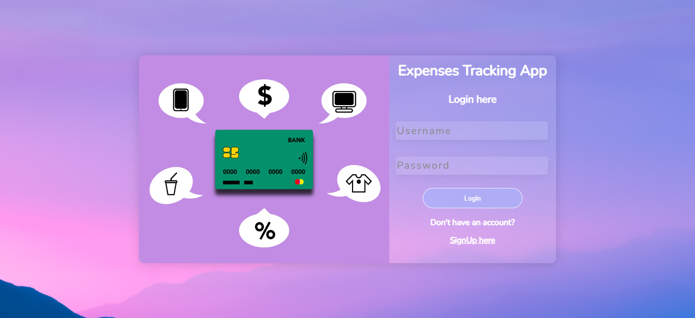
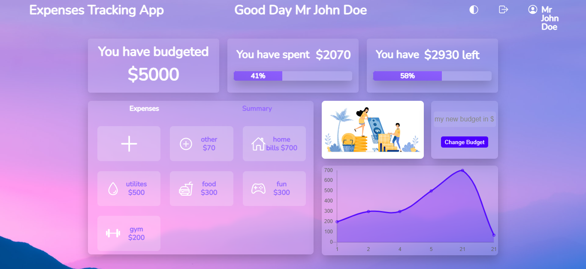

# preview images




# expenses-tracking-app
A basic expenses tracking app that allows unique users to log in and enter personalized budgets  and various expenses and to keep track and budget plan. Also included is a line graph imported from chart.js which gives an overview with dates and prices for the various expenses entered

# How to use this app
1. Download XAMPP.
2. Open XAMPP and click start for the Apache and MySQL modules.
3. Download the entire file on my github named "ExpenseTrackingApp" and go to local disk/xampp/htdocs and save it there. You can change the name of this folder to whatever you want although do not leave spaces between the naming and please remember the name of the folder as you will use it later.
4. Open your browser and type "localhost/ExpenseTrackingApp" or "localhost/<Name of your saved folder>" and press enter.
5. A login page should load and this is where you can login or signup to the app.
6. But wait, before you login you need to create the database first or php will give you an error as php will not be able to find the database.

# How to create the database:
7. Once you have completed the above steps, open a new tab next to the ExpenseTrackingApp tab then search "localhost/phpmyadmin".
8. once the page loads, you will see the homepage. To the left you will see a dashboard with a list of other databases which you can ignore. Click on the new button then you will be taken to another page which will have databases as the heading then create databases as the sub heading then a section to create a new database and the other databses which you saw on your left will be under this create section. In this create section, type the new databse to create as "expenses_tracking_app_database" then click create.
9. Once the new database has been created, open it then to the top, you will see some tabs with the first being labelled as "Structure", the second as "SQL". You will click on the sql tab and that you to a page that allows you to write sql code. In that tab insert this code without modifying it:

```mysql

CREATE TABLE expensetrackingusers(
    USER_ID int(11) AUTO_INCREMENT PRIMARY KEY NOT NULL,
    USERS_UID TINYTEXT NOT NULL,
    USERS_PWD LONGTEXT NOT NULL,
    USERS_EMAIL TINYTEXT NOT NULL,
    USERS_BUDGET int(11) NOT NULL
);
```

```mysql

CREATE TABLE expenses (
    EXPENSE_ID int(11) AUTO_INCREMENT PRIMARY KEY NOT NULL,
    expenses_icon_name TINYTEXT NOT NULL,
    expenses_price int(11) NOT NULL,
    date_logged TINYTEXT NOT NULL,
    EXPENSES_ID INT NOT NULL,
    FOREIGN KEY (EXPENSES_ID) REFERENCES expensetrackingusers(USER_ID)
);
```

once you are done, scroll down and click "Go" and the new tables should be created.

# SignUp/Login:
10.Now you can signup, complete the form data and click signup then you will be taken to the home dashboard if you signup successfully. You can now log expenses and the databse will keep them saved for you even if you log out.
